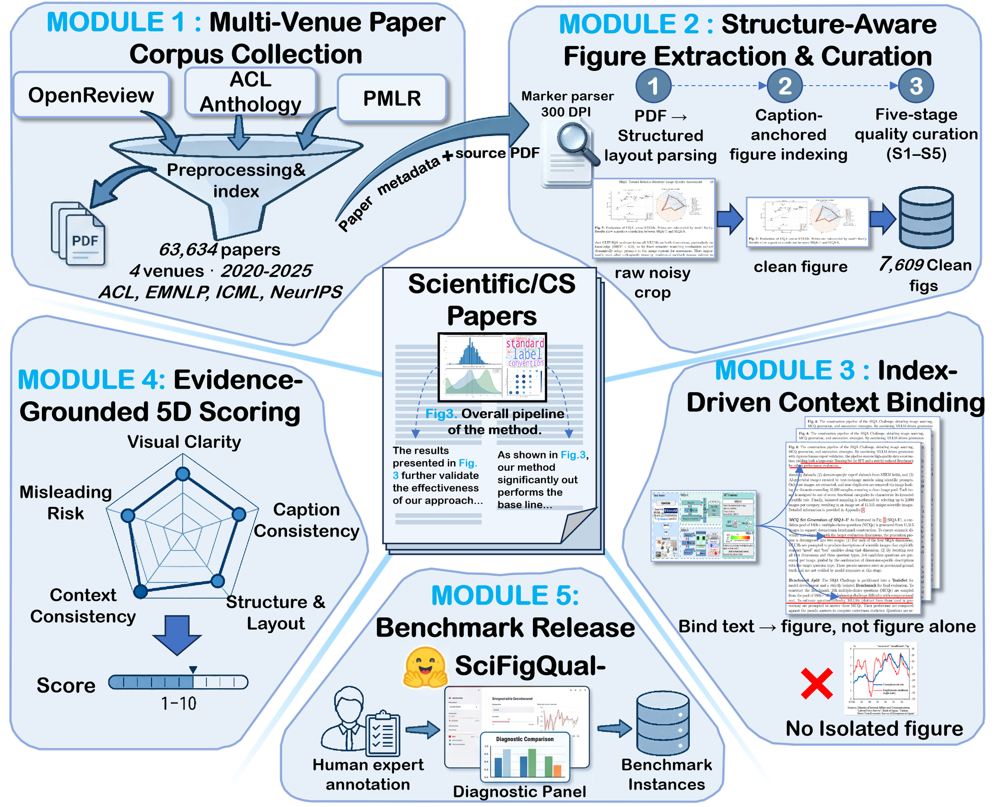
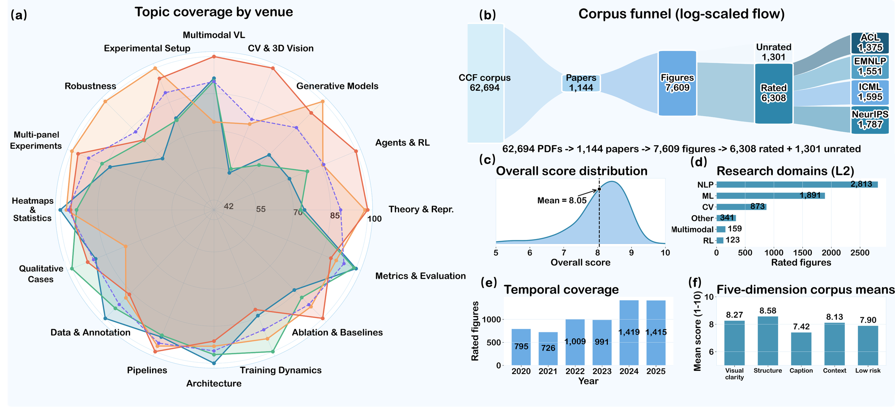
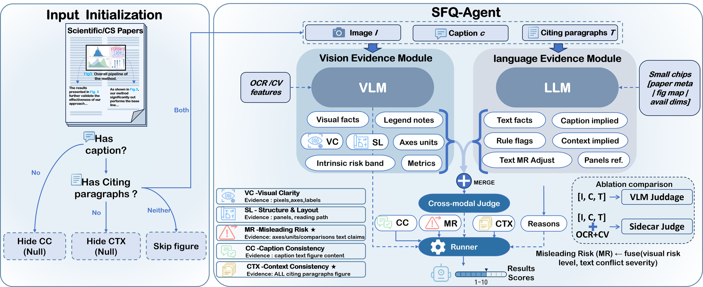

# SciFigQual-Bench

**A Benchmark for Scientific Figure Quality Assessment with Full-Manuscript Context**

[](https://arxiv.org/abs/2607.27084)
[](https://www.python.org/)
[](https://opensource.org/licenses/MIT)
[](https://huggingface.co/datasets/haihanlamu/SciFigQual-Bench)
[](https://arxiv.org/abs/2607.27084)

[Overview](#overview) · [Highlights](#highlights) · [Benchmark](#benchmark-at-a-glance) · [SFQ-Agent](#sfq-agent) · [Installation](#installation) · [Data](#data) · [Scoring](#scoring) · [Evaluation](#evaluation) · [Citation](#citation)

---

Scientific figure quality in peer review is **tri-modal**: reviewers cross-check the figure \(I\), the caption \(c\), and the citing paragraphs \(\mathcal{T}\). Natural IQA, AIGC alignment, and chart QA typically score **isolated** visuals without manuscript evidence.

**SciFigQual-Bench** binds each published CS figure to full-manuscript context and scores five orthogonal dimensions on a unified 1–10 scale. **SFQ-Agent** collects vision and language evidence in stages, then fuses them with a cross-modal judge for auditable, rubric-aligned scores.

**Release scope.** This repository ships the evaluation code (three judge protocols, prompts, and benchmark scripts). The gold dataset is hosted on [Hugging Face](https://huggingface.co/datasets/haihanlamu/SciFigQual-Bench).

---

## Highlights

- **Full-manuscript context.** Each instance is \((I, c, \mathcal{T}, m)\): figure image, caption, index-driven citing paragraphs from the source PDF, and metadata.
- **Large-scale gold standard.** **7,609** curated figures from **1,144** qualified papers; **6,308** expert-rated instances with aggregated five-dimensional scores.
- **Top venues, 2020–2025.** ACL, EMNLP, ICML, NeurIPS; ~355k citing-paragraph records.
- **Five-dimensional rubric.** Visual Clarity (VC), Structure & Layout (SL), Caption Consistency (CC), Context Consistency (CTX), Misleading Risk (MR), with L1 evidence gating.
- **SFQ-Agent.** Staged evidence + cross-modal fusion; on **eval1200** (*n*=1,200), SFQ-Agent with GPT-5.6-Sol (F3) reaches **MAE 0.418** and **93.4%** within-1 agreement vs. human gold.
- **29 protocol–backend runs.** Direct (D1–D11), Sidecar (S1–S9), and SFQ-Agent (F1–F9) in [`configs/eval1200_ablation.yaml`](configs/eval1200_ablation.yaml).

---

## Overview

SciFigQual-Bench closes the manuscript-context gap for **published** CS conference figures:

1. **Acquire & curate** PDFs from four top venues (62,694 raw → 7,609 clean figures).
2. **Bind context** via PDF index patterns (not abstract-only heuristics).
3. **Annotate** with a calibrated five-dimensional rubric and release a fixed public test split **eval1200**.

Direct and Sidecar judges are ablations on the **same** rubric and I/O schema — performance gaps reflect judging strategy, not data representation.

---

## Benchmark at a Glance

| Item | Count / value |
|------|----------------|
| Raw PDF corpus | 62,694 |
| Qualified papers | 1,144 |
| Curated figures | 7,609 |
| Human gold instances | 6,308 |
| Public test split `eval1200` | 1,200 (stratified) |
| Venues | ACL, EMNLP, ICML, NeurIPS |
| Years | 2020–2025 |
| Mean overall human score | 8.05 (rated subset) |

### Construction pipeline

<p align="center">
  
</p>
<p align="center"><em>Corpus collection → structure-aware extraction → context binding → five-dimensional rubric → expert validation.</em></p>

| Module | Description |
|--------|-------------|
| **1 — Corpus acquisition** | Crawl OpenReview, ACL Anthology, PMLR; normalize PDFs; SHA-256 dedup; venue/year indexing. |
| **2 — Figure extraction** | Marker layout parsing @ 300 DPI; caption–figure matching; five-stage curation (S1–S5). |
| **3 — Context binding** | PyMuPDF index patterns → citing paragraphs per figure; ~355k paragraph records. |
| **4 — Human annotation** | Pilot calibration; dual-rater holdout; L1 gating hides CC/CTX when evidence is absent. |
| **5 — Release packaging** | JSONL + images; stratified **eval1200** split; unified judge I/O schema. |

### Dataset statistics

<p align="center">
  
</p>
<p align="center"><em>Venue–topic radar, construction funnel, score distribution, domain counts, temporal coverage, and per-dimension means.</em></p>

Key takeaways from the rated subset (*n*=6,308):

- **Funnel yield** \(\eta = N/K_0 \approx 12.1\%\) reflects strict curation, not noisy crawling.
- **CC is the weakest axis** (mean 7.42) vs. SL (8.58) — caption–figure mismatches dominate real defects.
- **Temporal coverage** peaks in 2024–2025, supporting evaluation on modern plotting styles.

---

## Five-Dimensional Rubric

Scores use a **1–10** Likert scale per dimension. Overall score is a gated mean over available dimensions.

| Dim | Name | What it measures |
|-----|------|------------------|
| **VC** | Visual Clarity | Readability, resolution, contrast, label legibility |
| **SL** | Structure & Layout | Panel organization, alignment, visual hierarchy |
| **CC** | Caption Consistency | Caption faithfully describes visible content |
| **CTX** | Context Consistency | Figure supports claims in citing paragraphs |
| **MR** | Misleading Risk | Truncated axes, missing baselines, deceptive encodings |

**L1 gating:** CC is null when the caption is absent; CTX is null when citing text is absent; instances lacking both are excluded from scoring.

Prompt templates: [`model_scoring/prompts/`](model_scoring/prompts/) (Direct / Sidecar) and [`model_scoring/agent_scoring/prompts/`](model_scoring/agent_scoring/prompts/) (Agent).

---

## SFQ-Agent

Caption and context consistency are hard for monolithic VLMs. **SFQ-Agent** implements evidence-grounded judging in staged tracks:

<p align="center">
  
</p>
<p align="center"><em>L1 gating → parallel vision / language evidence → cross-modal judge → deterministic Runner aggregation.</em></p>

| Stage | Role |
|-------|------|
| **0 — Input & gating** | Load \((I, c, \mathcal{T})\); apply L1 dimension hiding. |
| **1 — Vision evidence** | PaddleOCR-VL + CV descriptors → structured `visual_facts` for VC / SL. |
| **2 — Language evidence** | LLM reads caption + citing text only (no pixels) for CC / CTX cues. |
| **3 — Cross-modal judge** | Fuse tracks; score CC, CTX, MR; detect visual–text conflicts. |
| **4 — Runner** | Deterministic aggregation; rule-based MR caps; traceable score lineage. |

### Judge protocols

| Protocol | API calls / figure | Description |
|----------|-------------------|-------------|
| **Direct Judge** | 1 | Single VLM prompt over \((I, c, \mathcal{T})\) |
| **Sidecar Judge** | 1 | Direct prompt + PaddleOCR-VL / CV side features |
| **SFQ-Agent** | 3 | Staged VLM evidence → LLM evidence → cross-modal judge |

Entry points:

- Direct / Sidecar: [`model_scoring/score_and_upload.py`](model_scoring/score_and_upload.py)
- SFQ-Agent: [`model_scoring/agent_scoring/run_agent_score.py`](model_scoring/agent_scoring/run_agent_score.py)

### eval1200 experiment matrix

Fixed public test split: **1,200** figures stratified by venue and figure type ([`configs/human_eval_subset_1200.jsonl`](configs/human_eval_subset_1200.jsonl)).

| Family | Run IDs | Backends (examples) |
|--------|---------|---------------------|
| Direct | D1–D11 | Gemini, GPT, Claude, Qwen, GLM, Doubao, Llama, Pixtral, Nova, Opus, InternVL |
| Sidecar | S1–S9 | Same subset + OCR side features |
| SFQ-Agent | F1–F9 | Staged agent with matched VLM / LLM pairs |

Full matrix: [`configs/eval1200_ablation.yaml`](configs/eval1200_ablation.yaml) (29 runs).

---

## Repository Layout

```
.
├── model_scoring/           # Direct & Sidecar judges, prompts, provider registry
│   └── agent_scoring/       # SFQ-Agent (staged pipeline)
├── src/cs64/                # Data I/O, OCR / CV feature pipeline (Sidecar)
├── scripts/
│   ├── benchmark/           # eval1200 matrix, metrics, prediction tools
│   ├── build_datasets.py
│   └── export_readme_figures.py
├── configs/
│   ├── eval1200_ablation.yaml
│   └── human_eval_subset_1200.jsonl
└── docs/figures/            # README figures (Fig. 2–4 from the paper)
```

---

## Installation

Python **3.11+** is required. Clone the repository and create an isolated environment:

```bash
git clone https://github.com/FrankDengAI/SciFigQual-Bench.git
cd SciFigQual-Bench
python -m venv .venv
```

Activate with `source .venv/bin/activate` on macOS / Linux, or `.venv\Scripts\Activate.ps1` in Windows PowerShell. Then install dependencies:

```bash
python -m pip install --upgrade pip
python -m pip install -r requirements.txt
```

Or with [uv](https://github.com/astral-sh/uv):

```bash
uv sync
```

Optional GPU extras (PaddleOCR-VL for Sidecar): see [`pyproject.toml`](pyproject.toml) `[dependency-groups.gpu]`.

### API keys (live inference)

**Default:** vendor HTTP calls are blocked via [`model_scoring/live_api_guard.py`](model_scoring/live_api_guard.py) so the public repo ships without secrets:

```
NotImplementedError: Set API keys in .env to run live inference (see README).
```

To enable live scoring:

1. Copy [`.env.example`](.env.example) → `.env` and set provider keys.
2. Remove or bypass `block_live_inference()` in the client entry points you intend to call.

---

## Data

**Dataset:** [huggingface.co/datasets/haihanlamu/SciFigQual-Bench](https://huggingface.co/datasets/haihanlamu/SciFigQual-Bench)

After download, a typical local layout is:

```
datasets/full/
├── figures.jsonl           # 6,308 instances
├── human_means.csv         # aggregated gold means
├── images/                 # 6,308 PNG crops
└── splits/eval1200.jsonl   # fixed public test manifest
```

This repository also ships [`configs/human_eval_subset_1200.jsonl`](configs/human_eval_subset_1200.jsonl) as the eval1200 manifest used by the scoring scripts.

Source PDFs and raw crawls are not redistributed here. Follow the Hugging Face dataset card for data terms when reusing figure crops and manuscript text.

---

## Scoring

### Dry-run the experiment matrix

```bash
python scripts/benchmark/run_experiment_matrix.py \
  --config configs/eval1200_ablation.yaml
```

### Score one Direct / Sidecar configuration

Requires live APIs enabled (see Installation):

```bash
python model_scoring/score_and_upload.py \
  --batch-mode paper \
  --manifest configs/human_eval_subset_1200.jsonl \
  --skip-upload \
  --provider gemini \
  --model gemini-2.5-flash \
  --prompt-mode baseline
```

### Score with SFQ-Agent

```bash
python model_scoring/agent_scoring/run_agent_score.py \
  --manifest configs/human_eval_subset_1200.jsonl \
  --skip-upload
```

Adjust provider / model flags to match a run in [`configs/eval1200_ablation.yaml`](configs/eval1200_ablation.yaml).

---

## Evaluation

Compare model predictions against human gold:

```bash
python scripts/benchmark/evaluate_vs_human.py \
  --predictions outputs/benchmark_eval1200/D1/results.jsonl \
  --human datasets/full/human_means.csv
```

Aggregate tables across the matrix:

```bash
python scripts/benchmark/aggregate_experiment_results.py
```

Primary reported metrics on eval1200: **MAE**, **within-1 agreement**, and per-dimension error against expert means.

### Regenerate README figures

```bash
python scripts/export_readme_figures.py --paper-dir /path/to/paper
```

---

## Reproducibility Notes

- Public entry points accept paths through CLI arguments; no machine-local paths are embedded.
- The eval1200 split is fixed in [`configs/human_eval_subset_1200.jsonl`](configs/human_eval_subset_1200.jsonl) for fair protocol comparison.
- Live vendor APIs are blocked by default; enable keys only when running fresh inference.
- Exact paper numbers require matched backends, prompts, and decoding settings, plus the Hugging Face gold labels.
- Dependency files use compatible lower bounds rather than a full environment lock — record resolved versions for new experiments.

---

## License

Source code in this repository is released under the **MIT License**. Dataset terms are stated on the [Hugging Face dataset card](https://huggingface.co/datasets/haihanlamu/SciFigQual-Bench).

---

## Citation

If you use SciFigQual-Bench or SFQ-Agent, please cite:

```bibtex
@article{deng2026scifigqual,
  title={SciFigQual-Bench: A Benchmark for Scientific Figure Quality Assessment with Full-Manuscript Context},
  author={Deng, Zihan and Xu, Chuanzhi and Liang, Huiqi and Li, Haoyang and Zhong, Xiaozhen and Yu, Lequan},
  journal={arXiv preprint arXiv:2607.27084},
  year={2026}
}
```
